# DHCP

## Instalação

Primeiramente, precisamos instalar o dnsmasq

    $ apk add dnsmasq

## Configuração

Verifique o ip da interface de rede 

    $ ip -br -c a

Altere o ip da interface se necessário

    $ nano /etc/network/interfaces

No meu caso, alterei o ip da minha interface para 192.168.8.254

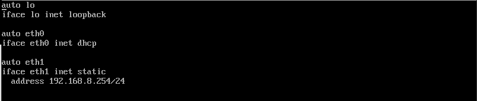

Reinicie a interface de rede com os comandos 

Para derrubar a interface:

    ifdown eth1

Para subir a interface:

    ifup eth1

Verifique se a interface reiniciou com o IP configurado

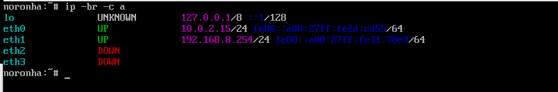

Acesse o diretório do dnsmasq e crie um arquivo de configuração

    /etc/dnsmasq.d/exemplo.conf

Insira as seguintes configurações:

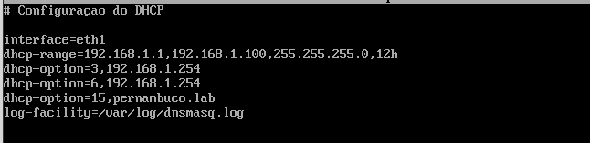

    

Após as configurações realizadas, vamos executar os comandos para ver o status do serviço e dar o start no mesmo.

Para ver o status execute:

    rc-service dnsmasq status

Para startar o serviço, execute:

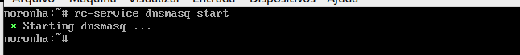

    rc-service dnsmasq start

Verifique novamente o status do serviço para se certificar que está tudo bem.

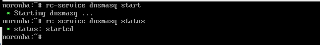

Se realizar qualquer alteração, reinicie o serviço do dnsmasq:

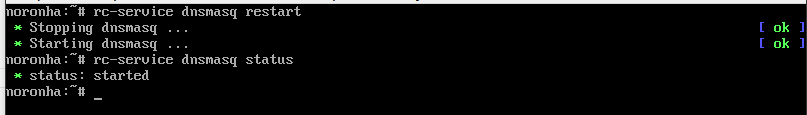

Agora vamos testar o serviço DNS em uma outra maquina windows na mesma rede.

Nas configurações do adaptador de rede do windows, verifique se está configurada com um ip fixo:

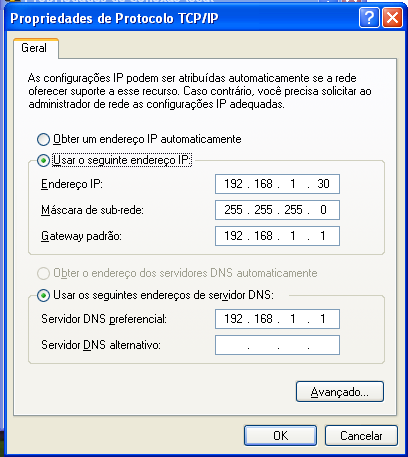

Se sim, que é o meu caso, vou alterar para Obter um endereço de IP e DNS automaticamente  e Clique em Ok.

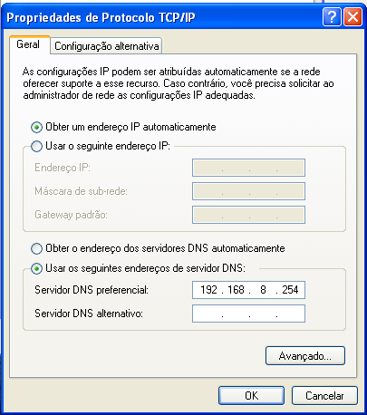

## Teste

Para verificar se a maquina está pegando o IP Dinâmico, iremos abrir o cmd e executar o comando nas duas máquinas criadas para os testes:

    $ ipconfig

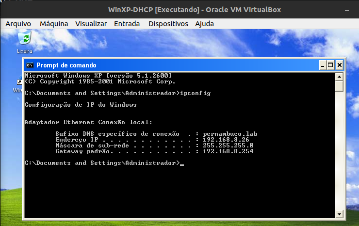

Agora vamos reservar 02 ips fixos. Para necessidades como impressora e servidor.

Para isso precosamos alterar o arquivo dnsmasq.conf acrescentando o endereço MAC e o IP desejado.

    dhcp-host=<Endereço MAC>,IP

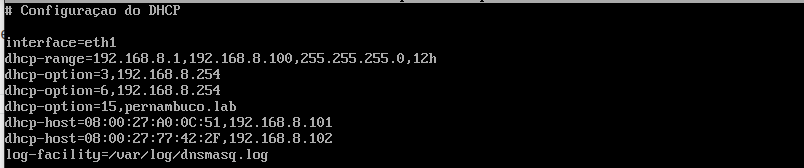

Obs: Lembre de reiniciar o serviço do dnsmasq

Vamos executar o comando ipconfig nas duas VMs que criamos para os testes:

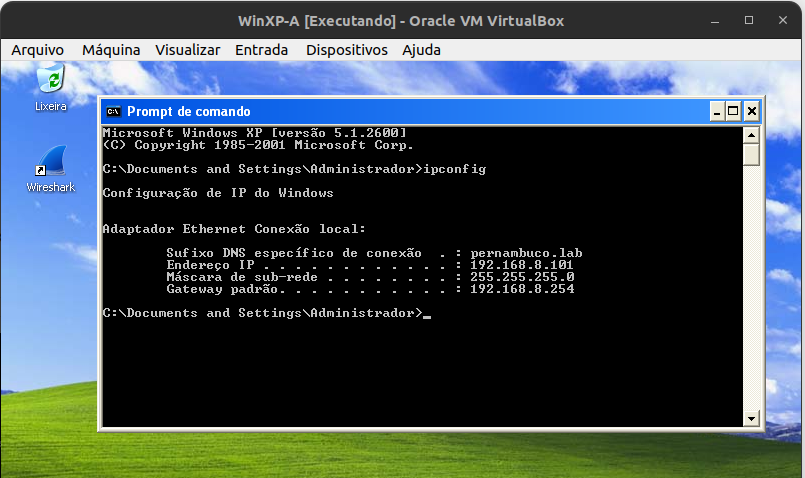

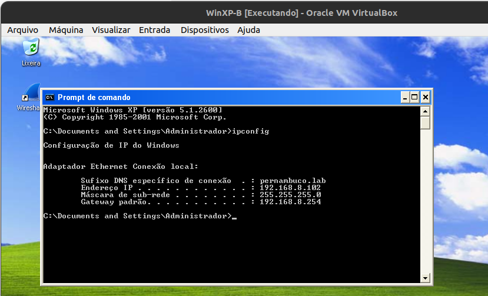

Incluir o(s) nome(s) e o conteúdo do(s) arquivo(s) de configuração.

- Distribuir um intervalo (*range* em inglês) de endereços IP; (15 pontos)
- Reservar 2 endereços (IP fixo) fora do intervalo do item anterior. (5 pontos)
