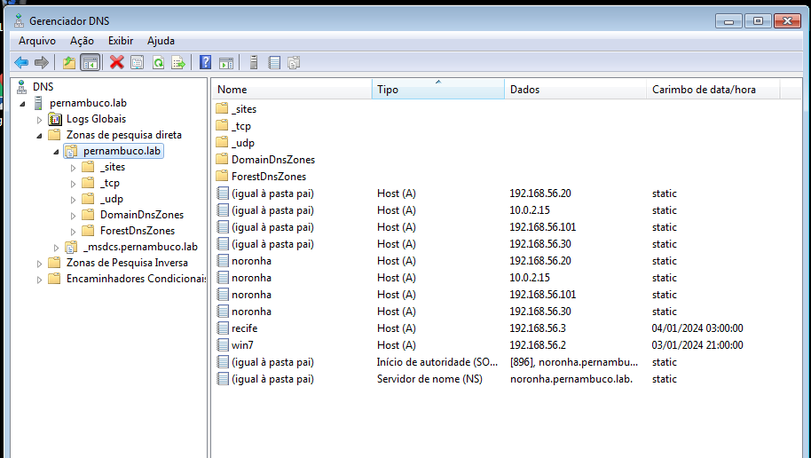

# DNS

## Instalação

Precisamos instalar o servidor SAMBA e deixar ele ativo. O cliente Windows tem que está configrurado no mesmo domínio de DNS como nas configurações para o SAMBA. No meu caso **pernambuco.lab**

Instalação [SAMBA](/smb/)

## Configuração

Com o serviço SAMBA funcionando, vamos até a máquina cliente com Windows para as configurações de DNS

No cliente windows nas propiedades do adaptador de rede, configure o ip estático desejado. Lembre que ele precisa fazer parte da mesma rede do **SAMBA**. Também configure o **GATEWAY** e o **DNS**.

No menu inicar pesquise por **DNS**

Clique em **DNS**. Na janela que abrir, digite o dominio configurado no servidor **SAMBA** (pernambuco.lab).

Se estiver tudo OK, irá abrir a seguinte janela:

Clique em: servidor pernambuco.lab > Zonas de pesquisa direta > pernambuco.lab

clique com o botão direito na área em branco e em seguida em Novo Host (A ou AAA). 

Agora em **Nome** configure o nome do servidor da sua necessidadee coloque o ip da máquina desejada. MArque a opção PTR.

Agora, no mesmo local, clique mais uma vez com o botão direito e clique em **Novo alias (CNAME).

Configure criando o nome desejado que no meu caso será `www` e no FQDN Procure pelo host desejado, que em nosso caso foi **kids**.

Vamos criar mais um **Host** chamdo `Inspire` e mais um **CNAME** chamdo `docs`.

Hosts

CNAME

## Teste

Agora vamos realizar o teste do ping com **www** para ver se nosso **DNS** está funcionando corretamente.

Abra o **CMD** no cliente Windows e digite o comando:

Para pingar em www

    $ ping www

Para pingar em docs

    $ ping docs

Incluir o(s) nome(s) e o conteúdo do(s) arquivo(s) de configuração.

Cinco registros (4 pontos cada):

- 2 do tipo A (Endereços);
- 2 do tipo CNAME (`www` e `docs`);