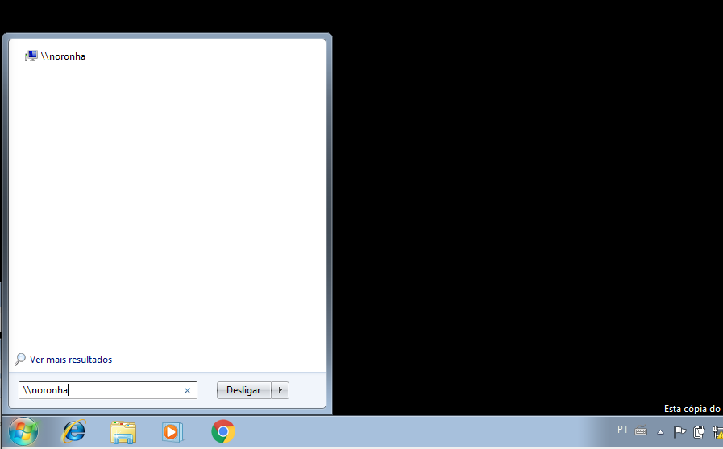

# LDAP

## Instalação

## Configuração

Para criar as OUs No menu iniciar do cliente, pesquise por active e clique em "Usuários e Computadores do Active Directory"

Na janela que abriu, clique no servidor pernambuco.lab

Em seguida, clique com o botão direito no espaço em branco do container e clique em "novo" e em seguida, no submenu clique em "Unidade Organizacional"

Dê o nome desejado a sua OU e clique em OK

Para mover os grupos criados e seus usuários para a OU desejada, clique com o botão direito no grupo desejado e em seguida clique em mover... Em seguida repita o processo nos usuários.

Na janela que abriu selecione a OU de destino desejada

Incluir o(s) nome(s) e o conteúdo do(s) arquivo(s) de configuração.

- Criar duas OU: `vendedores` e `rh`;
- Mover o grupo `sobrenome1` e seus membros para a OU `vendedores`;
- Mover os grupo `sobrenome2` e seus membros para a OU `rh`.

## Teste

Clique na OU desejada para verificar se os grupos e usuários estão em seus lugares.

Vá na opção para trocar de usuário e faça login com um dos usuários criados.

Insira as credenciais de login

no menu iniciar, digite \\\noronha e aperte enter. uma janela com as pastas compartilhadas deve abrir.

Se toda configuração estiver correta, ao clicar na pasta do grupo ao qual o login pertence, a pasta deve abrir normalmente, e ao clicar na pasta do grupo ao qual o usuário do login não pertence, ele pedirá um login e senha.

