# PROXY

## Instalação

Para instalar o squid, vamos executar o seguinte comando

    $ sudo apt install squid

O squid é um software extremamente pequeno, mas na medida em que você vai configurando, o consumo de recursos pode ficar muito grande.

## Configuração

Primeiro vamos entrar no diretorio do squid para ver os arquivos dentro dele.

    $ cd /etc/squid

Agora liste os arquivos

    $ ls

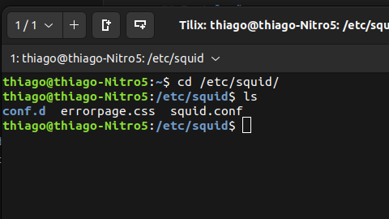

o arquivo squid.conf é onde tem todas as configurações do squid. É nele que faremos nossas configurações nas ACLs. O squid.conf é um arquivo gigantesco. Na data de hoje, esse arquivo tem 9168 linhas, como mostra a imagem abaixo.

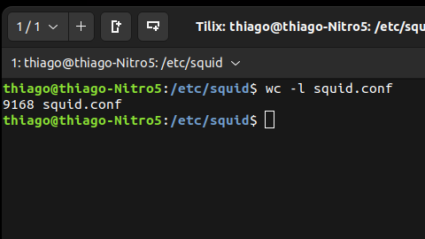

Vamos dar uma diminuida nesse arquivo. Vamos renomear o arquivo original para squid.conf-original. Nunca trabalhe em cima do arquivo original, pois qualquer erro temos como consultar e/ou corrigir.

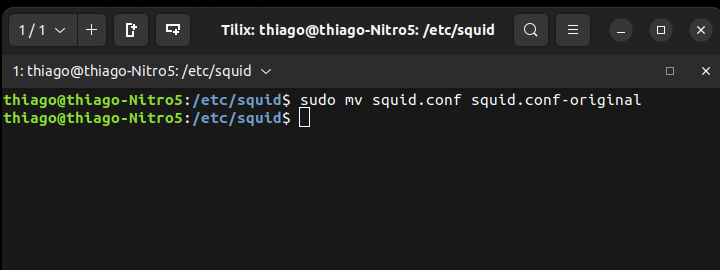

Feito isso, crie o arquivo squid.conf com seu editor de texto preferido. 

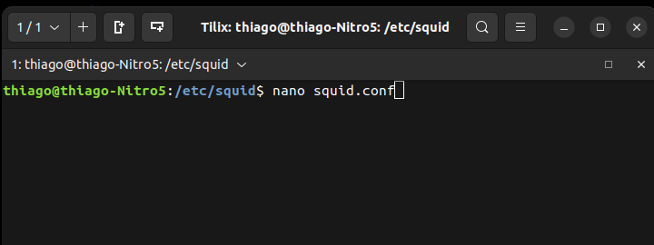

Dentro do arquivo original temos:

* ACL - Access Control List (Lista de controle de acesso)
 * As ACL tem que ser criadas antes do HTTP que falam o nome dela.
 * A ACL também não serve para nada se não tiver um HHTP chamando ela.

* HTTP_ACCESS - Controle de permisões para ACL
 * os HTTP sempre estão para permitir ou negar alguma ACl
 * Trabalham com AND e NOT, os dois conceitos boleanos. Nisso podemos ter HTTP combinando ou negando ACL
 * Eles são hierarquicos, são lidos de cima para baixo. sendo assim, o primeiro enocntrado é usado como regra. Por isso muita gente erra no squid por não organizar o HTTP. Quanto mais para baixo o HTTP ele se torna uma regra mais geral do que as primeiras que são mais específicas.

Este é o formato de uma ACL

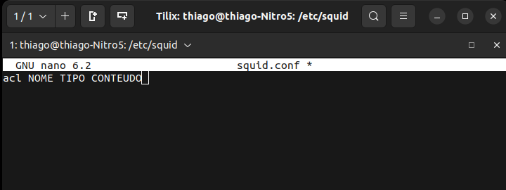

No arquivos que criamos squid.conf-original, vamos usar o seguinte filtro

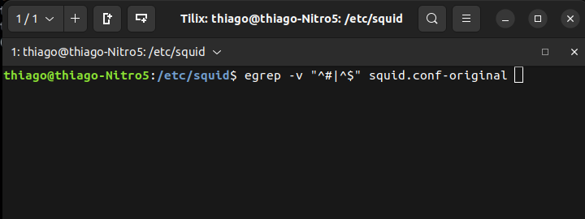

O **-V** irá filtrar para não mostrar linhas, e o ^# que começam com # que são comentário e ^$ as linhas vazias.

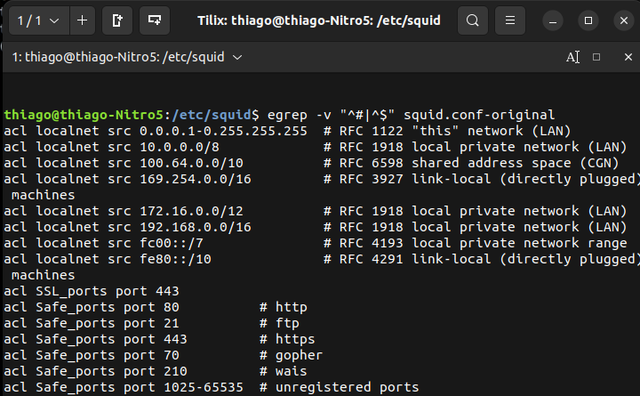

Vamos copiar todo o conteúdo filtrado no squid.conf-original para o arquivo que criamos squid.conf

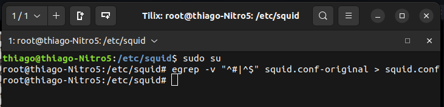

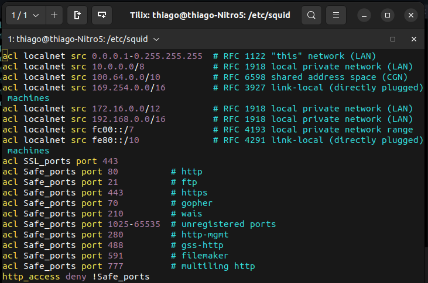

Agora vou configurar minhas ACLs de acordo com o que preciso. Separei as ACLs e HTTPs em grupos para ficar mais organizado. Criei os grupos **Meus ACLs** e **Meus HTTP_ACCESS** os separando dos padrões do squid.

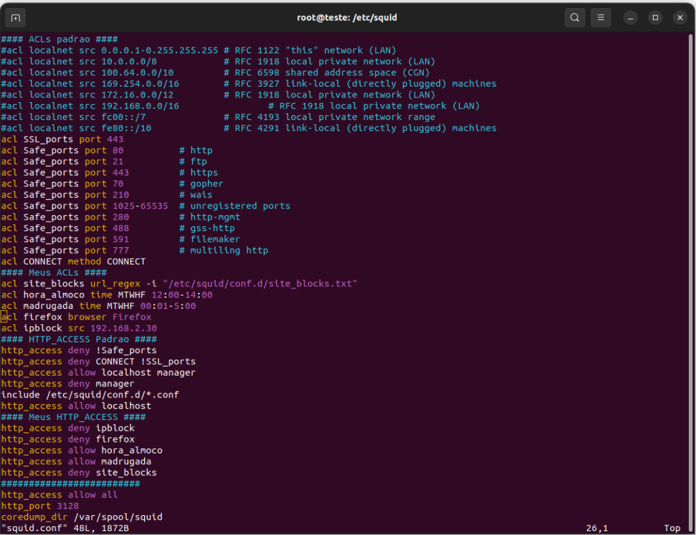

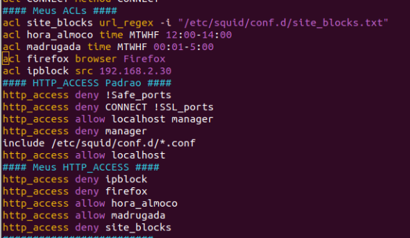

Incluir o(s) nome(s) e o conteúdo do(s) arquivo(s) de configuração.

Fazer a configuração de 4 ACLs distintas, conforme a atividade passada em sala de aula.

## Teste

**LOGs**

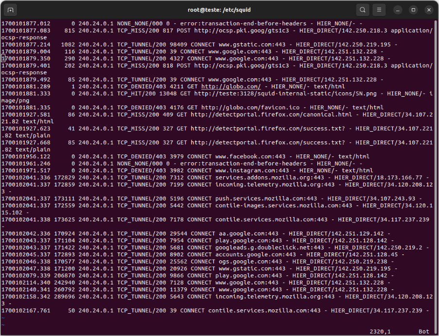

**bloqueio acl sites_block facebook instagram globo.com**

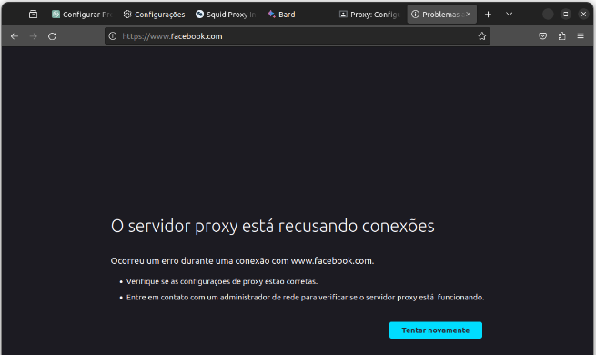

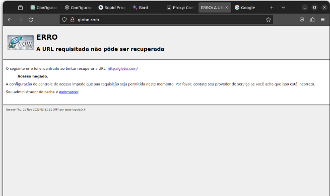

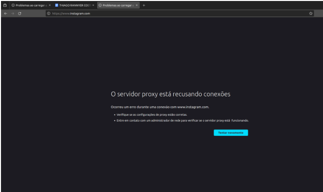

**ACLs liberadas por horario**

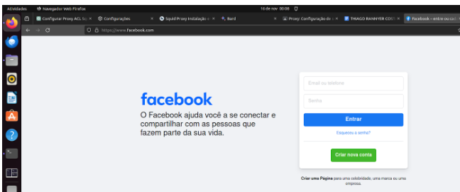

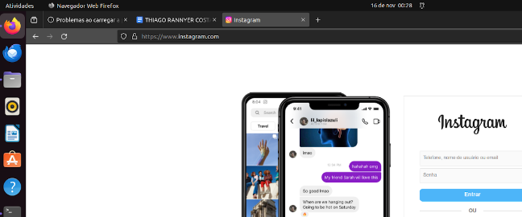

**ACL bloqueio do browser firefox**

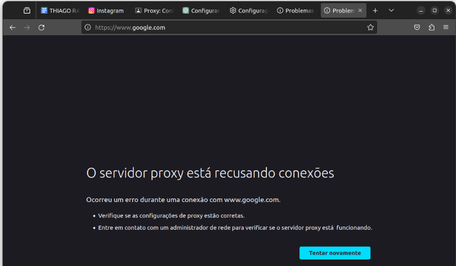

