# SMB

## Instalação

Para instalar o SAMBA, execute os comandos a seguir:

Instalar o pcaote samba:

    $ apk add samba

Executar o servidor SAMBA:

    $ rc-service samba start

Se desejar que o serviço SAMBA inicie automaticamente no boot, você pode executar o comando:

    $ rc-update add samba

## Configuração

Agora vamos executar o comando abaixo para executar algumas configurações:

    $ samba-tool domain provision --user -rfc2307 --interactive

onde o comando "samba-tool domain provision" é usado para provisionar um novo controlador de domínio usando o Samba.

A opção "--user" especifica que você deseja adicionar um usuário administrador durante o processo de provisionamento.

A opção "--rfc2307" isso é comumente usado quando você deseja integrar sistemas Unix/Linux ao ambiente do Active Directory.

A opção "--interactive" faz com que o comando seja executado de forma interativa, solicitando informações adicionais durante o processo.

Em resumo, o comando está provisionando um controlador de domínio Samba, adicionando um usuário administrador, configurando atributos RFC2307 e executando de forma interativa para fornecer informações adicionais durante o processo. Este é um procedimento comum ao configurar um ambiente que requer a integração do Samba com o Active Directory para autenticação e compartilhamento de arquivos em ambientes mistos Unix/Linux e Windows.

Precisamos editar o arquivo smb.conf

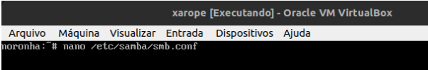

Neste caso, iremos inserir as seguintes informações:

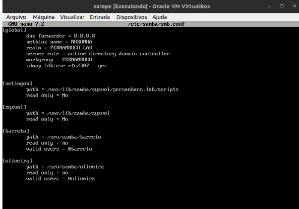

criar os diretórios que foram inseridos no smb.conf (diretórios que serão compartilhados):

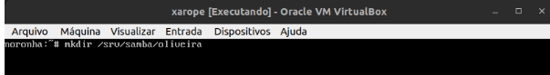

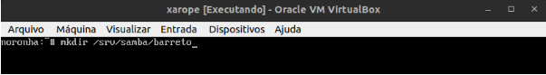

Edite também o arquivo hosts em /etc/hosts para definirmos um domínio em nosso **DNS**.

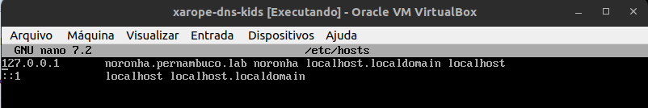

Vamos reiniciar o SAMBA

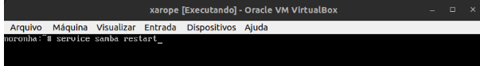

Alterar o ip da máquina cliente

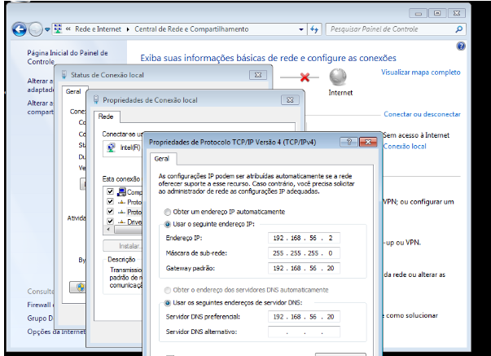

ativa o compartilhamento de arquivos e pastas

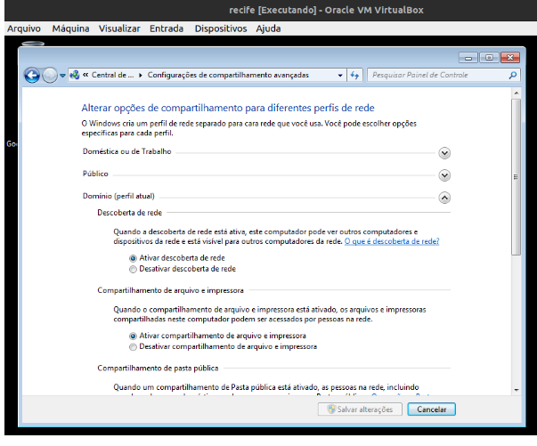

ir em iniciar > click direto em computador > propriedades > alterar configuração > alterar > marcar a opção domínio e colocar o domínio configurado pernambuco.lab

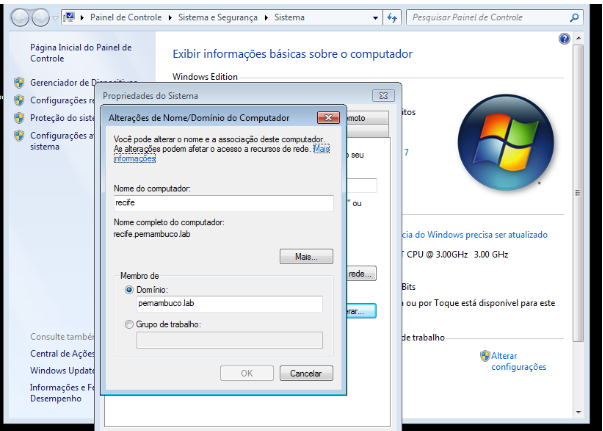

Nomenu iniciar do cliente, pesquise por active e clique em "Usuários e computadores do Active Directory"

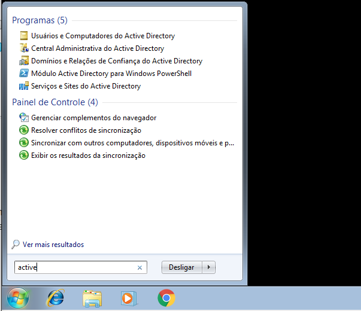

Para criar os grupos e usuários você pode já criar nas OUs desejadas como também pode mover após criar, como fizemos no LDAP.

Para criar os Grupos, faça login como administrador, abra o active directory, selecione a OU desejada, clique no ícone "criar grupo no container atual" ou clique com o botão direito na área em branco do container > clique em novo > e em Grupo.

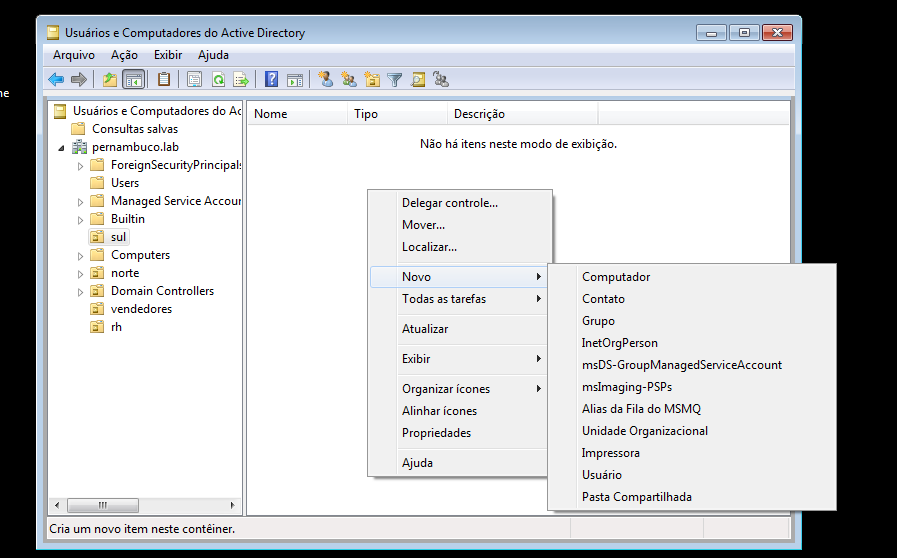

Dê o nome desejado ao grupo e clique em OK.

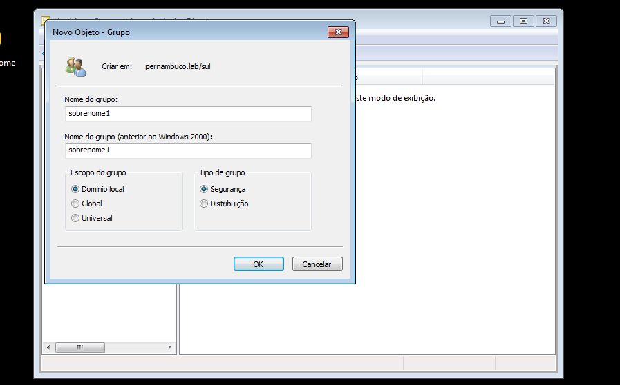

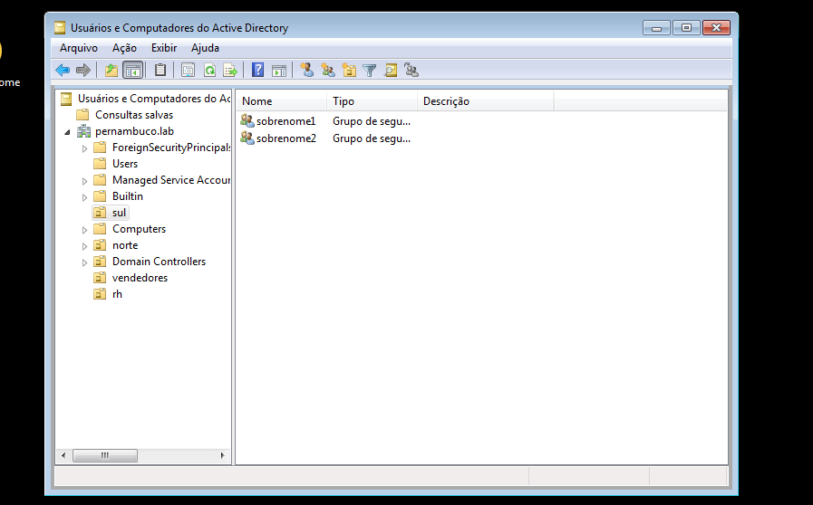

Agora para criar os usuários, faça login como administrador, abra o active directory, selecione a OU desejada, clique no ícone "criar usuário no container atual" ou clique com o botão direito na área em branco do container > clique em novo > e em usuário.

Na janela que abriu, coloque as informações necessárias. e clique em avançar.

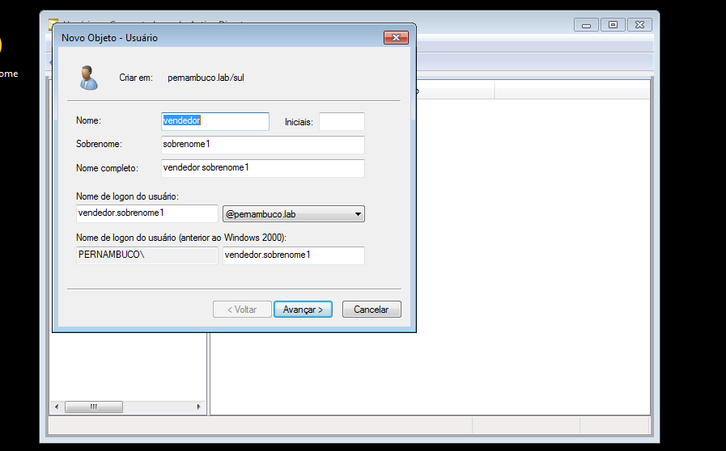

cConfigure uma senha segura, marque ou desmarque as opções desejadas e clique em avançar.

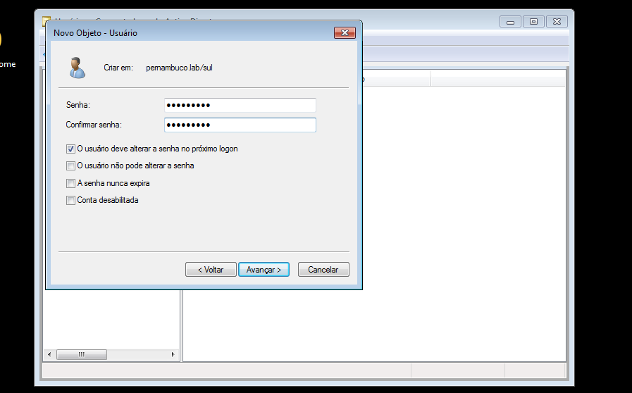

Confira se está os dados apresentados e clique em concluir.

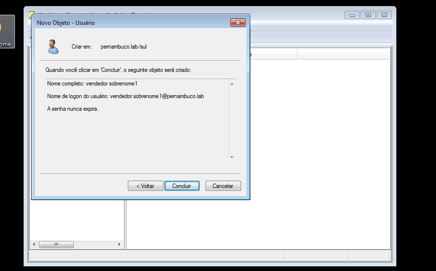

Para adicionar os usuários aos seus respectivos grupos, clique ocom o botão direito no usuário desejado > adicionar a um grupo > 

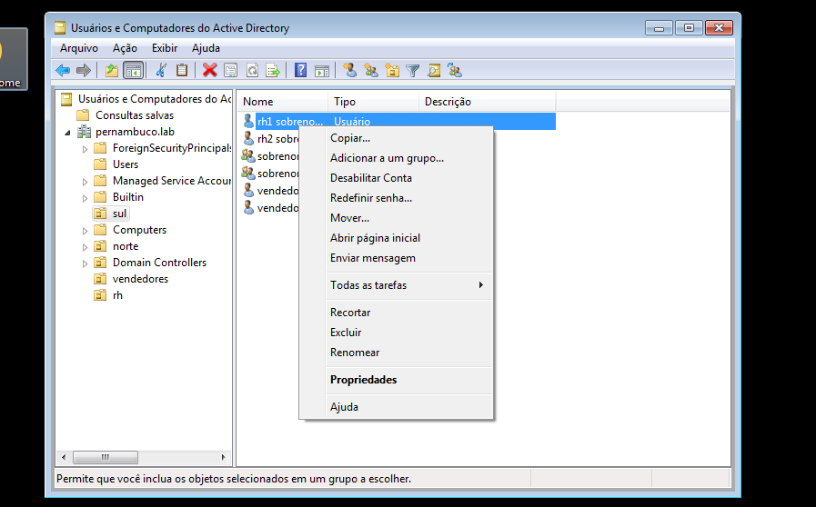

Digite o nome do grupo desejado e clique em OK. Repita quantas vezes forem necessário para cada usuário que desejar adicionar a um grupo.

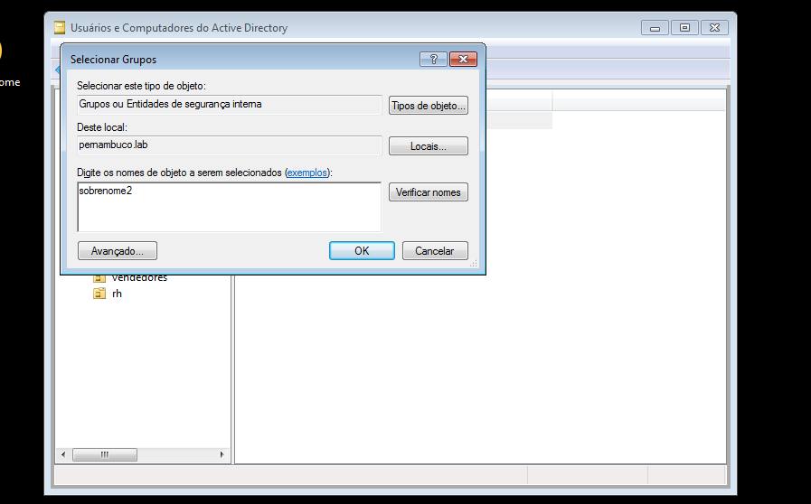

Incluir o(s) nome(s) e o conteúdo do(s) arquivo(s) de configuração.

1. Criar 2 grupos para dois de seus sobrenomes;
2. Criar 4 usuários, dois para cada um dos sobrenomes;
3. Compartilhar duas pastas com dois de seus sobrenome, compartilhado para o grupo com o sobrenome correspondente. 

## Teste

